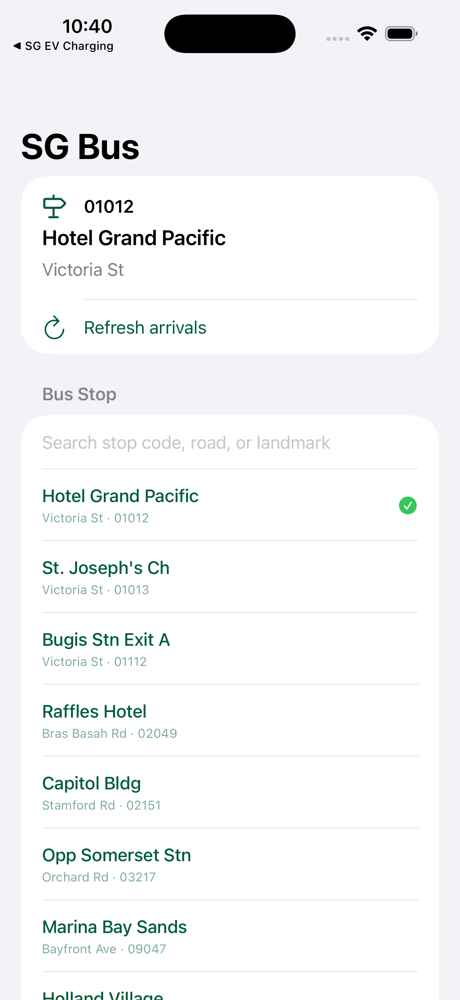

<div align="center">

# SG Bus

[](https://swift.org)
[](https://developer.apple.com/ios/)
[](https://developer.apple.com/xcode/swiftui/)
[](#license)

**Fast Singapore bus arrival lookups for iPhone and iPad.**

[Report Bug](https://github.com/alfredang/sgbusapp/issues) · [Request Feature](https://github.com/alfredang/sgbusapp/issues)

</div>

## Screenshot



## About

SG Bus is a native SwiftUI app for checking live Singapore bus arrival timings from LTA DataMall. It focuses on quick stop selection, manual refresh, and a compact view of the next three arrivals for each service.

Key features:

- Search common Singapore bus stops by stop code, road, or landmark.
- View live arrivals from LTA DataMall BusArrivalv2.
- Compare the next three bus timings for each service.
- See useful load and vehicle-type labels such as seats, standing, limited, single, double, and bendy.
- Pull to refresh or use the dedicated refresh action.

## Tech Stack

| Layer | Technology |
| --- | --- |
| App | Swift 6, SwiftUI |
| Platform | iOS 17.0+ |
| Networking | URLSession, async/await |
| Data Source | LTA DataMall BusArrivalv2 |
| Project Generation | XcodeGen `project.yml` |
| Distribution | Xcode archive and App Store metadata scripts |

## Architecture

```text
SwiftUI Views
    |
    v
BusArrivalsViewModel
    |
    v
LTADataMallClient
    |
    v
LTA DataMall BusArrivalv2 API
    |
    v
BusArrivalResponse / BusService / NextBus
```

## Project Structure

```text
.
├── AppStore/
│   └── metadata.md
├── Config/
│   ├── Local.xcconfig.example
│   └── Local.xcconfig          # local only, ignored by git
├── SGBusApp/
│   ├── Models/
│   ├── Services/
│   ├── ViewModels/
│   ├── Views/
│   ├── Assets.xcassets/
│   └── SGBusApp.swift
├── screenshots/
│   └── sgbus-iphone-raw.png
├── scripts/
├── project.yml
└── ExportOptions.plist
```

## Getting Started

### Prerequisites

- macOS with Xcode installed
- iOS 17.0+ simulator or device
- XcodeGen, if regenerating the Xcode project
- LTA DataMall account key

### Setup

1. Clone the repository.

   ```bash
   git clone https://github.com/alfredang/sgbusapp.git
   cd sgbusapp
   ```

2. Create the local configuration file.

   ```bash
   cp Config/Local.xcconfig.example Config/Local.xcconfig
   ```

3. Add your LTA DataMall account key to `Config/Local.xcconfig`.

   ```xcconfig
   LTA_ACCOUNT_KEY = your_lta_datamall_account_key
   ```

4. Open the Xcode project.

   ```bash
   open SGBus.xcodeproj
   ```

5. Build and run the `SGBus` scheme from Xcode.

### Regenerate Project

If you edit `project.yml`, regenerate the Xcode project with:

```bash
xcodegen generate
```

## Configuration

`Config/Local.xcconfig` is intentionally ignored by git because it contains the LTA DataMall account key. Keep production keys out of source control and use the committed `Config/Local.xcconfig.example` as the setup template.

## App Store

App Store metadata lives in `AppStore/metadata.md`. Submission helper scripts are available in `scripts/` for App Store Connect automation.

## Contributing

1. Fork the repository.
2. Create a feature branch.
3. Make a focused change with matching validation.
4. Open a pull request with a concise description and screenshots when UI changes are involved.

## License

No open-source license has been published for this repository yet. All rights reserved unless a license file is added.

## Acknowledgements

- Singapore Land Transport Authority DataMall for bus arrival data.
- Apple SwiftUI and iOS platform tooling.
