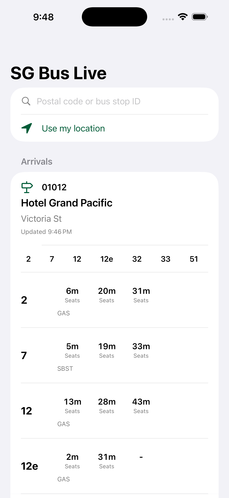

<div align="center">

# SG Bus Live

[](https://swift.org)
[](https://developer.apple.com/ios/)
[](https://developer.apple.com/xcode/swiftui/)
[](#license)

**Live Singapore bus arrival times for iPhone — find the nearest stop by GPS, search by postal code or bus stop ID, then track any service.**

<a href="https://apps.apple.com/us/app/sg-bus-live/id6782321279"></a>

[Report Bug](https://github.com/alfredang/sgbusapp/issues) · [Request Feature](https://github.com/alfredang/sgbusapp/issues)

</div>

## Screenshot



## About

SG Bus Live is a native SwiftUI app for checking live Singapore bus arrival timings from LTA DataMall. It finds the bus stops nearest to you using GPS, lets you jump straight to a stop by postal code or bus stop ID, and shows the next three arrivals for every service — with the option to filter down to a single bus number.

The app is organised into four bottom tabs: **Arrivals**, **Favorites**, **Feedback**, and **About**.

Key features:

- **GPS nearest stops** — auto-detects your location and lists the closest bus stops with walking distance.
- **Search at the top** — enter a 6-digit postal code (geocoded via OneMap) or a 5-digit bus stop ID; or search by road / landmark.
- **Pick a bus number** — tap a service chip to filter the arrivals to just that bus.
- **Favorites** — save your regular stops (persisted on-device) and recall them from the Favorites tab.
- **Feedback** — send feature requests or bug reports over WhatsApp from the Feedback tab.
- **Live arrivals** — the next three timings per service from LTA DataMall, with load (seats / standing / limited) and vehicle-type labels.
- **Pull to refresh** or use the dedicated refresh action.

## Tech Stack

| Layer | Technology |
| --- | --- |
| App | Swift 6, SwiftUI |
| Platform | iOS 17.0+ (iPhone) |
| Location | CoreLocation (nearest-stop detection) |
| Networking | URLSession, async/await |
| Data Sources | LTA DataMall (BusArrival, BusStops), OneMap (postal-code geocoding) |
| Project Generation | XcodeGen `project.yml` |
| Distribution | Xcode archive + App Store Connect API scripts |

## Architecture

```text
SwiftUI Views (ContentView)
    |
    v
BusArrivalsViewModel  ──────────────┐
    |              |                │
    v              v                v
LocationManager  BusStopStore   OneMapClient
 (CoreLocation)   (cached LTA       (postal code
    |              bus stops)        -> coordinate)
    |              |
    v              v
        LTADataMallClient
    |
    v
LTA DataMall (BusArrival / BusStops)
```

- **LocationManager** wraps CoreLocation for a one-shot GPS fix.
- **BusStopStore** downloads the full LTA bus-stop directory (with coordinates) once, caches it on disk, and answers nearest-by-GPS, exact-code lookup, and text search.
- **OneMapClient** geocodes a Singapore postal code to a coordinate.
- **LTADataMallClient** fetches live arrivals and the paginated bus-stop list.

## Project Structure

```text
.
├── AppStore/
│   └── metadata.md
├── Config/
│   ├── Local.xcconfig.example
│   └── Local.xcconfig          # local only, ignored by git
├── SGBusApp/
│   ├── Models/                 # BusStop, BusService, NextBus
│   ├── Services/               # LTADataMallClient, BusStopStore, LocationManager, OneMapClient
│   ├── ViewModels/             # BusArrivalsViewModel
│   ├── Views/                  # ContentView
│   ├── Assets.xcassets/        # AppIcon
│   └── SGBusApp.swift
├── screenshots/
├── scripts/                    # App Store Connect automation + icon generator
├── project.yml
└── ExportOptions.plist
```

## Getting Started

### Prerequisites

- macOS with Xcode installed
- iOS 17.0+ simulator or device
- XcodeGen, if regenerating the Xcode project
- LTA DataMall account key

### Setup

1. Clone the repository.

   ```bash
   git clone https://github.com/alfredang/sgbusapp.git
   cd sgbusapp
   ```

2. Create the local configuration file.

   ```bash
   cp Config/Local.xcconfig.example Config/Local.xcconfig
   ```

3. Add your LTA DataMall account key to `Config/Local.xcconfig`.

   ```xcconfig
   LTA_ACCOUNT_KEY = your_lta_datamall_account_key
   ```

4. Generate and open the Xcode project.

   ```bash
   xcodegen generate
   open SGBus.xcodeproj
   ```

5. Build and run the `SGBus` scheme. On first launch, allow location access to see nearby stops.

## Configuration

`Config/Local.xcconfig` is intentionally ignored by git because it contains the LTA DataMall account key. Keep production keys out of source control and use the committed `Config/Local.xcconfig.example` as the setup template.

`NSLocationWhenInUseUsageDescription` is set in `project.yml` so the app can request location to find nearby stops.

## App Store

**SG Bus Live is live on the App Store** — [download it here](https://apps.apple.com/us/app/sg-bus-live/id6782321279).

<a href="https://apps.apple.com/us/app/sg-bus-live/id6782321279"></a>

App Store metadata lives in `AppStore/metadata.md`. App Store Connect automation scripts are in `scripts/` (`asc_submit.py` for metadata/screenshots/submission, `asc_jwt.swift` for JWT signing, `make_app_icon.swift` for the app icon).

## Contributing

1. Fork the repository.
2. Create a feature branch.
3. Make a focused change with matching validation.
4. Open a pull request with a concise description and screenshots when UI changes are involved.

## License

No open-source license has been published for this repository yet. All rights reserved unless a license file is added.

## Acknowledgements

- Singapore Land Transport Authority DataMall for bus arrival and bus stop data.
- OneMap for postal-code geocoding.
- Apple SwiftUI, CoreLocation, and iOS platform tooling.
